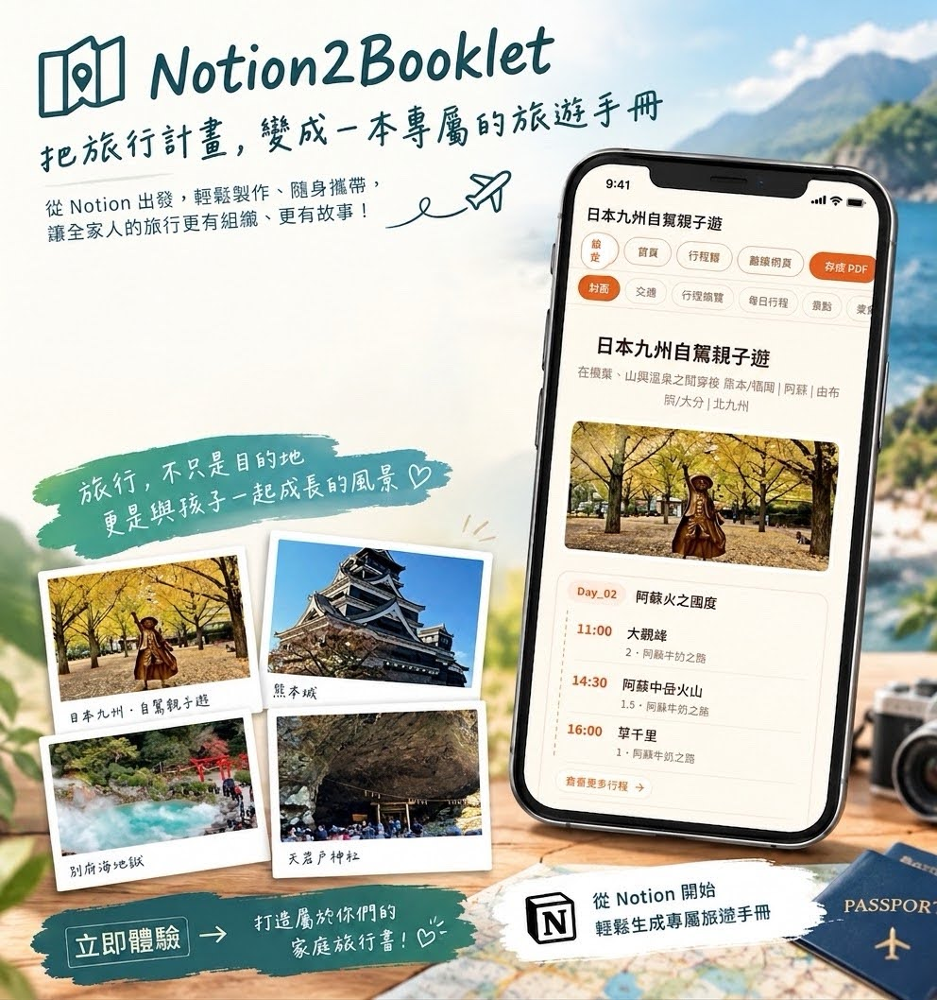

# 🇮🇹 2026 義大利多洛米蒂兩週遊

<aside>

## Notion 旅行規劃 × 一鍵輸出旅行小冊子 (v1.2 · 2026-09)

> **TravelBooklet Planner** 是一款可**「免費使用」**的 Notion 旅遊規劃模板，協助你有系統地整理行程、景點與親子資訊。
> 

> 規劃好之後，搭配 [**Notion2Booklet**](https://my.kidsthefuture.com)，一鍵將內容輸出為可列印、可線上分享的小冊子 。
> 

### 成品參考：[**日本九州自駕親子遊 (連結)](https://my.kidsthefuture.com/b/m2i2e6njgweqges8tveiiu)**

## 👉 [五分鐘做出你的小冊子 Notion2Booklet (連結)](https://my.kidsthefuture.com)

1. 在這個範本裡填好行程（至少填「行程總覽」和每日行程）
2. 打開上面的連結，按「連結 Notion」
3. Notion 請你勾選頁面時，**勾選這整個範本頁**

免費就能做出完整的一本，也能存成 PDF，看到成品再決定要不要留下它。**付費解鎖後**：照片拿掉浮水印，四種版型（清新、雜誌、手帳、兒童）任你切換，還能下載離線網頁、加入手機行事曆。

</aside>

<aside>

## [取得空白Notion 範本 (連結)](https://app.notion.com/p/3eaa2c52cabe80e3a81ced8a0c125ec7?pvs=21)

移除所有示範行程與範例紀錄，保留資料庫結構、欄位、公式、篩選及版面。點擊後直接複製到自己的 Notion 工作區

</aside>

<aside>

### **核心資料庫：**

- 請勿刪除預設欄位，可透過新增欄位或隱藏欄位方式擴充。
- 請勿修改 **Type** 欄位、公式欄位、關聯與彙總欄位。

[DB of TravelBooklet Planner](https://app.notion.com/p/DB-of-TravelBooklet-Planner-5ad54aaf45f08268bb7981294f1632bd?pvs=21)

</aside>

# Trip overview | 行程設定

<aside>

## **使用說明**

- **Purpose | 功能**
    - 設定整趟旅行的基本資訊，例如出發日期、旅行主題、旅程名稱、封面標題與圖片。
    - 請勿新增頁面，以 **修改** 的方式填寫以下欄位：
        
        **[trip_title]、[trip_subtitle]、[trip_duration]**，並拖曳上傳圖片至 **[trip_image]**。
        
- **小冊子輸出設定**
    - 行程資訊僅能有一列
    - **封面頁**
        - [**trip_title] 封面標題、[trip_subtitle] 封面副標題、[trip_image] 封面照片、[trip_duration] 顯示在副標下方。**
        - [**trip_country] 國家、[trip_country] 地區、[trip_style] 旅遊型態，可以自動整理旅行歷史紀錄。**
    - **行程總覽頁**
        - **[trip_page_name] 行程總覽頁標題**
</aside>

<aside>

## **行程資訊設定**

[List View of Trip Overview](List%20View%20of%20Trip%20Overview%2080b54aaf45f08375b367813ee688ed1b.csv)

</aside>

# Information | 旅行資訊

<aside>

## **使用說明**

- **Purpose | 功能**
    
    撰寫**交通資訊**(例如航班、車程)、**待辦清單**與**注意事項**，也是小冊子的素材來源。
    
- **小冊子輸出設定**
    - **交通頁面**
        - **[traffic_page_name]** — 交通頁面名稱（可自訂，預設名稱為 **“交通 | Transportation”**），可直接修改屬性變更顯示名稱。
        - **[traffic_slide_order]** — 交通項目輸出順序，預設 1–10，可新增項目。
    - **待辦事項頁面**
        - **[todo_page_name]** —  待辦事項頁面名稱 (可自訂，**預設名稱為”待辦事項 | Todo List”**)，可直接修改屬性變更顯示名稱。
        - 輸出時依 **[todo_type]** 排序，不另外細排。
    - **注意事項頁面**
        - **[notice_page_name]** —  注意事項頁面名稱 (可自訂，**預設名稱為”注意事項 | Notice”**)，可直接修改屬性變更顯示名稱。
        - 輸出時依 **[notice_type]** 排序，不另外細排。
</aside>

<aside>

## 交通資訊

<aside>

[List View of Traffic](List%20View%20of%20Traffic%20e5254aaf45f083c9995c01cb2108ff95.csv)

</aside>

</aside>

<aside>

## 待辦事項

<aside>

[List View of ToDo List](List%20View%20of%20ToDo%20List%20fa254aaf45f082f6b895819f274d52cc.csv)

 

</aside>

</aside>

<aside>

## 注意事項

<aside>

[List View of Notice](List%20View%20of%20Notice%20aaf54aaf45f08340803a0180af7afdfe.csv)

</aside>

</aside>

# Itinerary Planning | 行程規劃

<aside>

## **使用說明**

- **Purpose | 功能**
    - 安排每日行程、時間順序，並收集景點資訊，是小冊子的主要素材來源。
    - 主要兩張看板：**Day Planner** 與 **Day Overview**
    
    ### **Day Planner 操作步驟：**
    
    - Step 1: 新增景點至 [**Backlog]**
    - Step 2: **選取**每日 [**Day_title]**（第幾天，例如 Day_01），預設已建好1~30日，若沒有可以新建立 Day_31 ….
    - Step 3:  Board View 直覺拖曳景點到對應日期，資料日期自動更新
    - Step 4: 設定 [**itin_time], [itin_duration] & [spot_type]**
    - **Step 5:** 全部行程設定完後再依 **[itin_time]** 排序，方便檢視
        
         *(若一開始就排序，操作體驗較差)*
        
    
    ### Day Overview 設定：
    
    - 設定 **[day_image]** 作為當日主要視覺照片
    - 建立當日餐飲與住宿資訊：**[day_breakfast]、[day_lunch]、[day_dinner]、[day_hotel]**
        
        *(可先蒐集餐廳與住宿，再直接選取)*
        
- **小冊子輸出設定**
    - **行程表頁面**
        - **[Day_title]** — 每天一頁，依第幾天排序
        - 列出當日所有行程：**[itin_name]** 與 **[itin_time]**
        - **[itin_duration]、[spot_type]** 不顯示
        - **[day_breakfast]、[day_lunch]、[day_dinner]、[day_hotel]** 顯示在頁面底部
</aside>

<aside>

## **Itinerary | 行程表**

[Board View of Itinerary_Planner](Board%20View%20of%20Itinerary_Planner%209b754aaf45f0826e8bdb81f350ad739c.csv)

</aside>

<aside>

## **Day overview | 每日概覽**

[Board View of Day Overview](Board%20View%20of%20Day%20Overview%207e854aaf45f082eab1420159b0ea36f5.csv)

</aside>

# Spot  | 景點

<aside>

## **使用說明**

- **Purpose | 功能**
    - 所有景點、商店與活動的詳細資料放在此，填寫完整資訊：
        
        **[spot_name]、[spot_image]、[spot_description]、[spot_open_time]、[spot_website]、[spot_location]、[spot_phone]**
        
    - 可依 **[spot_page_name]** 分組並拖曳安排
- **小冊子輸出設定**
    - **景點頁面**
        - **[spot_page_name]** — 自訂景點頁面名稱，無名稱景點不輸出
        - **[spot_slide_order]** — 決定景點在頁面內順序**。**
        - **[spot_slide_type]** — 頁面風格：Type_A (路線風格)、Type_B (圖文左右交叉)、Type_C (左圖右文)
            - 每頁僅需設定一個景點，預設為 Type_B
</aside>

<aside>

[Gallery View of Itinerary_Spot](Gallery%20View%20of%20Itinerary_Spot%20b0654aaf45f082c3842d0182a39f640f.csv)

</aside>

# Food | 美食

<aside>

## **使用說明**

- **Purpose | 功能**
    - 所有美食詳細資料放在此，供 Day Overview 選擇早餐、午餐、晚餐使用
    - 欄位：**[food_name]、[food_image]、[food_description]、[food_address]、[food_phone]、[food_website_email]**
- **小冊子輸出設定**
    - **美食頁面**
        - **[food_page_name]** — 美食頁面名稱（可自訂，預設 **“美食 | Food”**）**，可直接修改屬性變更顯示名稱。**
        - **[food_slide_order]** — 顯示順序，預設 1–10，可新增**。**
</aside>

<aside>

[Gallery View of Food](Gallery%20View%20of%20Food%2083a54aaf45f0832c9dd501eeecd0288e.csv)

</aside>

# Stay | 住宿

<aside>

## **使用說明**

- **Purpose | 功能**
    - 所有住宿詳細資料放在此，供 Day Overview 選擇住宿使用
    - 欄位：**[stay_name]、[stay_image]、[stay_description]、[stay_address]、[stay_phone]、[stay_website_email]**
- **小冊子輸出設定**
    - **住宿頁面**
        - **[stay_page_name]** — 住宿頁面名稱（可自訂，預設 **“住宿資訊 | Hotel”**）**，可直接修改屬性變更顯示名稱。**
        - **[stay_slide_order]** — 顯示順序，預設 1–10，可新增**。**
</aside>

<aside>

[Gallery  View of Stay](Gallery%20View%20of%20Stay%20ba654aaf45f08238999d81eef86c99ac.csv)

</aside>

# Shopping List | 必買清單

<aside>

## **使用說明**

- **Purpose | 功能**
    - 呈現購物清單資訊
- **小冊子輸出設定**
    - **購物清單頁面**
        - **[buy_page_name]** — 購物清單頁面名稱（可自訂，預設 **“購物清單 | Shopping List”**）**，可直接修改屬性變更顯示名稱。**
</aside>

<aside>

[無標題](%E7%84%A1%E6%A8%99%E9%A1%8C%2015c54aaf45f08384923a019ee8eb64ea.csv)

</aside>

# Packing Planning | 行李打包規劃

<aside>

## **使用說明**

- **Purpose | 功能**
    - 管理所有行李物品，安排放置於包包或行李箱
    - **左側 List View：** 查看完整行李清單，列出所有要帶的行李，拖曳分組排序分類。
    - **右側 Board View：** 安排物品放置位置（托運行李箱、隨身包、後背包等，可新增）
    - 完成後逐一勾選 **[已打包]** 確認
- **小冊子輸出設定**
    - **行李打包頁面**
        - **[pack_page_name]** — 行李打包清單頁面名稱（可自訂，預設 **“行李打包清單 | Packing List”**）**，可直接修改屬性變更顯示名稱。**
        - 僅輸出 **左側打包清單**
</aside>

<aside>

## **Checklist | 打包清單**

[List View of Packing Checklist](List%20View%20of%20Packing%20Checklist%20c8454aaf45f082d9afdf81e540be6bb3.csv)

</aside>

<aside>

## **Planner | 分配規劃**

[Board View of Packing Checklist](Board%20View%20of%20Packing%20Checklist%2048354aaf45f083e5942801b3aadca43d.csv)

</aside>

# **升級成 Notion2Booklet，一鍵將行程變小冊子、旅遊網頁分享給旅伴**

<aside>
📔

## ****這份行程，可以變成一本帶得走的小冊子

行程整理到這裡，已經很完整了。但真正出門那天，它還是在手機裡——要翻、要滑、要等載入，而孩子在旁邊問「下一個要去哪」。

**印出來**　紙本在手，一天一頁，隨時可以看
**傳出去**　旅伴不用有 Notion，用手機瀏覽器就可觀看行程
**給孩子的**　景點賓果、任務卡、貼近旅行的小遊戲

免費就能做出完整的一本，看到成品再決定要不要留下它。付費解鎖後可以拿掉浮水印、換版型(手帳風、雜誌風、小孩冒險手冊)、下載成 PDF或離線網頁。

## 👉 [五分鐘做出你的小冊子 Notion2Booklet](https://my.kidsthefuture.com)

</aside>